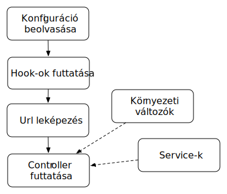

Ilx alapok
===========

Ezen az oldalon találod az Ilx alapjainak bemutatását.

Kodiak felépítése
------------------

A Kodiak egy egyszerű php nyelven készült web keretrendszer, amelynek segítségével php alkalmazásokat fejleszhetünk MVC
architektúrában. Az alábbiakban egy rövid összefoglalót adunk a Kodiak működéséről, ami szükséges az Ilx használatához.

A Kodiak egy monolitikus konfigurációban gondolkozik, amely tartalmaz minden szükséges beállítást az alkalmazás
futtatásához. A Kodiak ezt a konfigurációt felhasználva képes futtatni az alkalmazásunkat. A konfiguráció 5 fő pontot
tartalmaz:

 * **Környezeti változók (environment):** Környezeti változónak minősülnek azok a kulcs-érték párok, amelyekre az alkalmazás tetszőleges pontján szükség lehet. Ilyen lehet az időzóna vagy hogy milyen módban futtatjuk az alkalmazást (development, product)
 * **Hook-ok (hooks):** Olyan elemek, amelyeknek minden a webszerver felé indított kérés kezelése előtt le kell futtatni. Tipikusan jó példa erre a session inicializálása vagy annak vizsgálata, hogy a felhasználó jogosult-e egy adott weboldal megnyitására.
 * **Service-ek (services):** Olyan szolgáltatások, amelyekre nincsen szükség minden kérés kezelésénél, de elérésük alkalmazás tetszőleges pontján fontosak. Például ilyen szolgáltatás lehet az email-ek küldése, loggolás, weboldal tartalmának renderelése.
 * **Route-k (routes):** Az alkalmazásból elérhető útvonalak listája, amely minden útvonal esetén tartalmazza, hogy melyik Controller melyik metódusa kezeli az adott útvonalat.
 * **Router (router):** Tartalmazza, hogy milyen módszer alapján történjen az útvonalak leképezése. Ezzel nem kell foglalkozunk.

Ilx felépítése
---------------

Az Ilx a Kodiak-re épülő rendszer, amely
A plusz funkcionalitás, amit hozzátesz a Kodiak-hez, hogy a már korábba

mi az hogy modul, hogyan kapcsolódnak egymáshoz, hogyan indul el az alkalmazás
Modulok: jól körülhatárolt elem, ami logikailag egy fukncionalitás köré épül.

Első alkalmazásom
-------------------

